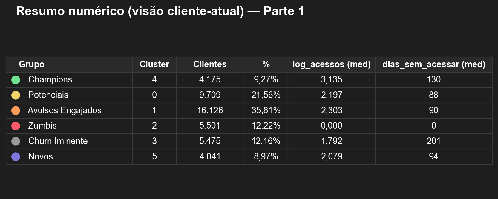
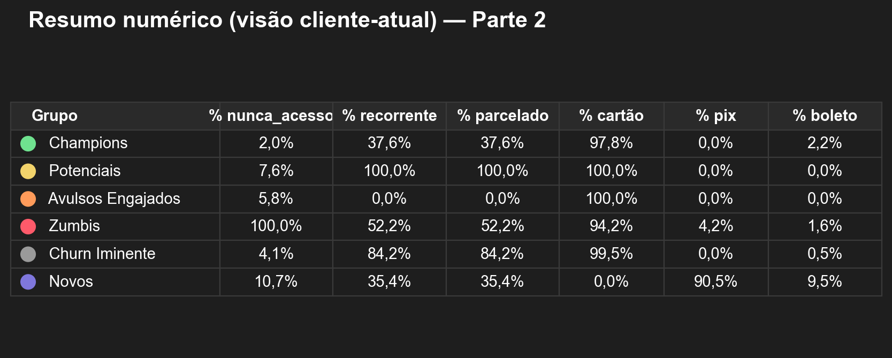
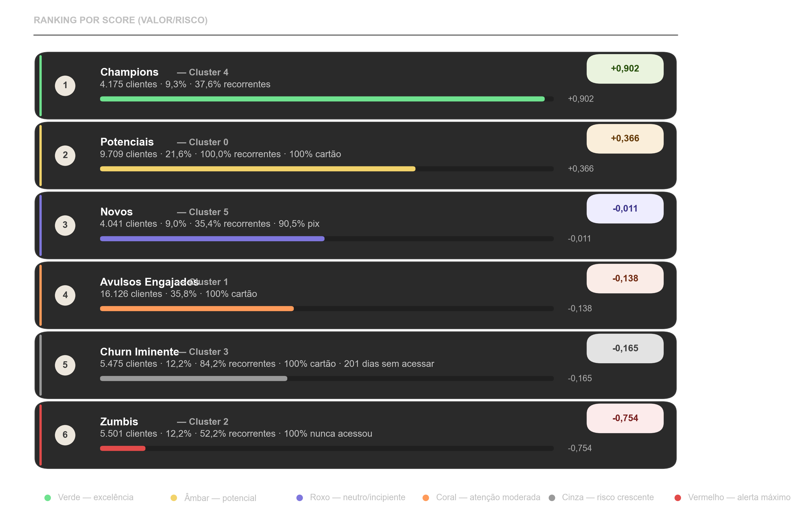
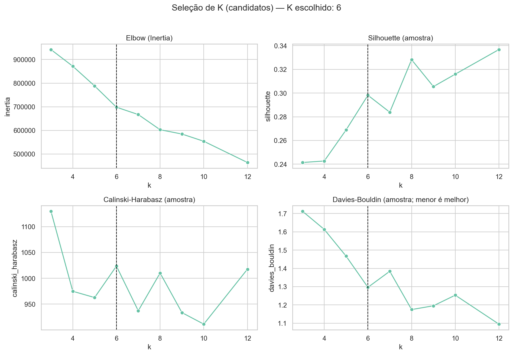
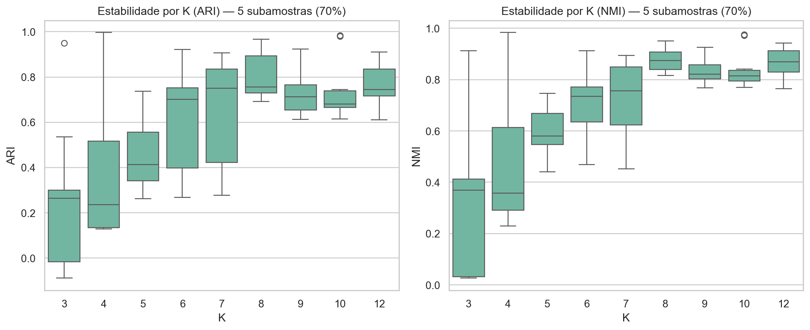
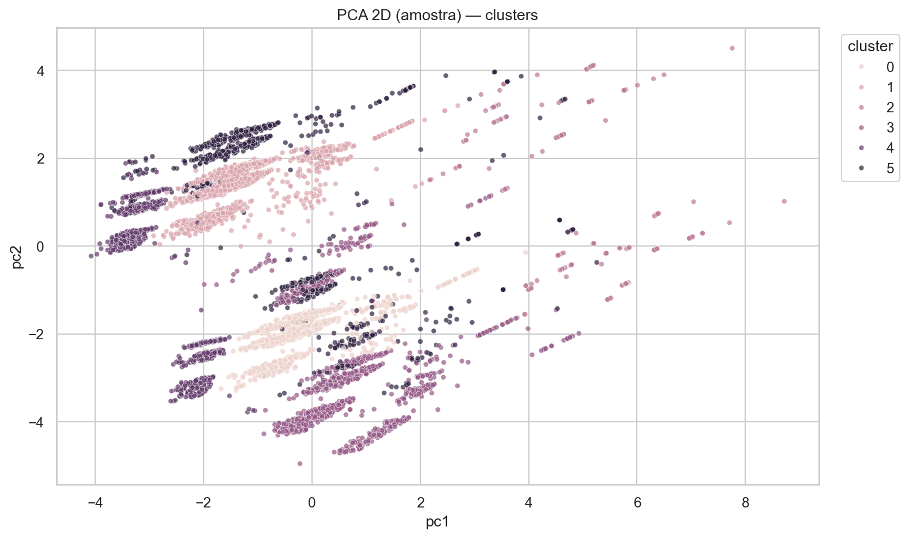
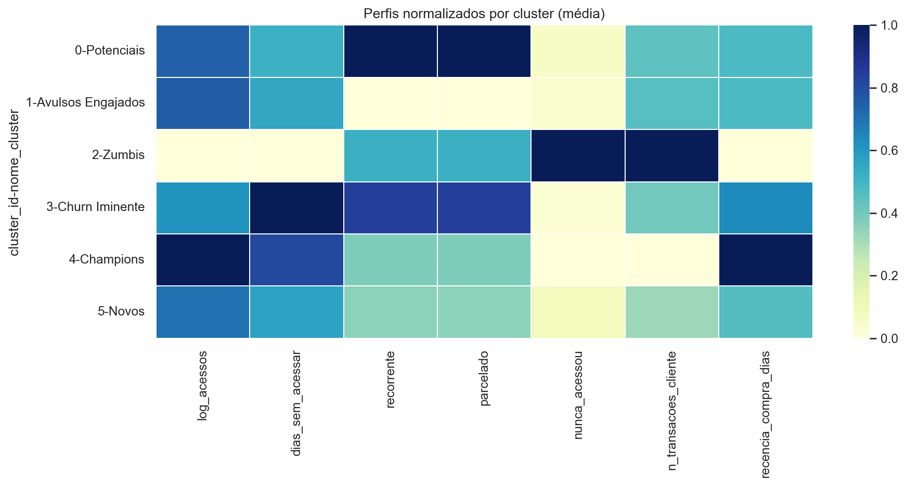
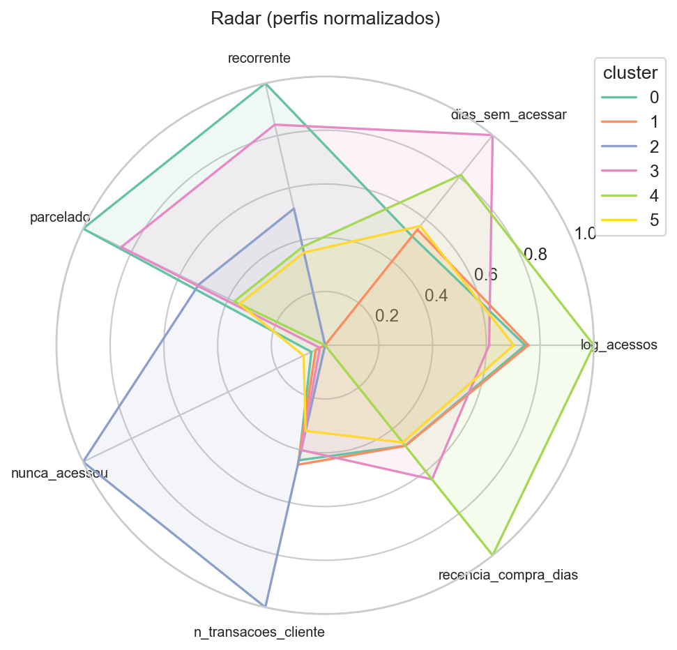

# Relatório Final — Segmentação de Clientes (K-Means)

## Sumário
- [1. Resumo executivo](#1-resumo-executivo)
- [2. Auditoria do projeto](#2-auditoria-do-projeto)
- [3. Dados e limpeza](#3-dados-e-limpeza)
- [4. Features escolhidas](#4-features-escolhidas)
- [5. Escolha de K orientada ao negócio](#5-escolha-de-k-orientada-ao-negócio)
- [6. Perfis dos clusters (Cluster Cards)](#6-perfis-dos-clusters-cluster-cards)
- [7. Respostas às 6 perguntas do case](#7-respostas-às-6-perguntas-do-case)
- [8. Plano de ação por cluster](#8-plano-de-ação-por-cluster)
- [9. Classificação automática de novos clientes](#9-classificação-automática-de-novos-clientes)
- [10. Limitações e próximos passos](#10-limitações-e-próximos-passos)

## 1. Resumo executivo
- K final: **6** (seleção por métricas + estabilidade + acionabilidade)
- Critérios de decisão: eliminamos clusters <2% (salvo exceção justificada), balanceamos elbow/silhouette e exigimos estabilidade (ARI/NMI) aceitável
- Grupo recorrente que não acessa: **3979 (8.84%)**; concentração por cluster na seção 7
- Melhor cluster (valor/risco): **Cluster 4** | pior: **Cluster 2** (score transparente)

Ações prioritárias (alto impacto):
- Ativação imediata de pagantes sem uso (nudges + onboarding 7 dias + contato CS)
- Playbook de retenção para risco de churn (gatilhos por inatividade + ofertas e diagnóstico de fricção)
- Expansão em Champions (upsell/cross-sell e indicação)

Legenda (nomenclatura “intuitiva” dos 6 grupos):
- 🟢 Champions (Cluster 4 | 9,27%) → maior engajamento e maior score de valor/risco; combinação mais saudável de uso + retenção/valor.
- 🟡 Potenciais (Cluster 0 | 21,56%) → recorrentes e engajados, mas com espaço para elevar valor percebido e reduzir inatividade.
- 🟠 Avulsos Engajados (Cluster 1 | 35,81%) → engajamento médio/alto, porém sem recorrência (oportunidade de conversão para assinatura).
- 🔴 Zumbis (Cluster 2 | 12,22%) → pagam e não usam (nunca acessam); maior risco de cancelamento e frustração do cliente.
- ⚪ Churn Iminente (Cluster 3 | 12,16%) → forte sinal de abandono por alta inatividade; exige retenção imediata.
- 🟣 Novos (Cluster 5 | 8,97%) → perfil mais “recente/instável” com sinais mistos (ex.: alta incidência de Pix/Boleto e menor renovação); precisa de onboarding e prova rápida de valor.


Resumo numérico (visão cliente-atual), em duas partes (melhor para relatório em retrato):







## 2. Auditoria do projeto
### Checklist de entregáveis
| artefato                   | status   |
|:---------------------------|:---------|
| dataset_clusterizado.xlsx  | OK       |
| resumo_clusters.xlsx       | OK       |
| kmeans_pipeline.joblib     | OK       |
| assets/k_selection.png     | OK       |
| assets/k_stability.png     | OK       |
| assets/pca_clusters.png    | OK       |
| assets/cluster_heatmap.png | OK       |
| assets/radar_clusters.png  | OK       |

### Estrutura de pastas
| item           | status   |
|:---------------|:---------|
| data/raw       | OK       |
| data/processed | OK       |
| notebooks      | OK       |
| src            | OK       |
| reports        | OK       |

### Notebooks
| notebook                                       | status   |
|:-----------------------------------------------|:---------|
| 01_eda_e_qualidade.ipynb                       | OK       |
| 02_limpeza_e_features.ipynb                    | OK       |
| 03_modelo_kmeans_escolha_k.ipynb               | OK       |
| 04_perfis_dos_clusters_e_acoes.ipynb           | OK       |
| 05_storytelling_executivo.ipynb                | OK       |
| 06_classificacao_novos_clientes_pipeline.ipynb | OK       |
| 07_shap_explicabilidade.ipynb                  | OK       |

- requirements.txt: **OK**

## 3. Dados e limpeza
- XLSX detectado: `data\raw\Base Customer Sucess.xlsx`
- PDF detectado: `data\raw\Customer Sucess.pdf`

### Nulos (top 10 colunas)
| coluna           |   pct_missing |
|:-----------------|--------------:|
| Tem Comunidade?  |       100.00% |
| Finalizou Curso? |        99.98% |
| aluno_id         |        99.49% |
| Acomp. Mensal    |        97.40% |
| epoca fup        |        91.33% |
| NPS              |        40.28% |
| epoca nps        |        39.69% |
| ultimo_acesso    |        17.38% |
| Criado na Wati   |         8.01% |
| Boas Vindas      |         0.54% |

### Unidade de análise
- % de clientes com >1 linha (granularidade transacional): **1.23%**

Distribuição de `n_transacoes_cliente = nunique(TRANSACAO)` por cliente:
| estat   |     valor |
|:--------|----------:|
| count   | 45027.000 |
| mean    |     1.018 |
| std     |     0.201 |
| min     |     1.000 |
| 50%     |     1.000 |
| 75%     |     1.000 |
| 95%     |     1.000 |
| max     |    12.000 |

- Conclusão: a clusterização deve ser no nível **cliente** (visão cliente-atual por data_ordem + agregados históricos), pois linhas representam transações.

### Outliers
- `n_acessos`: transformação `log1p` (reduz assimetria e influência de extremos)
- `dias_sem_acessar`: winsorização 1%–99% (reduz sensibilidade do K-Means a outliers)

## 4. Features escolhidas
| feature                     | tipo        | por_que_entra                                                           | transformacao                         |
|:----------------------------|:------------|:------------------------------------------------------------------------|:--------------------------------------|
| ativo                       | categorical | Status operacional do cliente (quando disponível)                       | imputação + one-hot/scale no pipeline |
| faixa_inatividade           | categorical | Segmentação interpretável da inatividade                                | binning                               |
| metodo_pagamento            | categorical | Distribuição cartão/pix/boleto                                          | mapeamento (cartao/pix/boleto/outro)  |
| parcelas_nao_recorrente_bin | categorical | Detalhe de parcelamento apenas para não-recorrentes (evita redundância) | binning (1, 2–3, 4–6, 7+)             |
| renovacao                   | categorical | Retenção (renovou ou não)                                               | imputação + one-hot/scale no pipeline |
| status                      | categorical | Status transacional (sinal de sucesso/ruído operacional)                | imputação + one-hot/scale no pipeline |
| dias_sem_acessar            | numeric     | Inatividade (proxy de risco de churn)                                   | winsor 1–99%                          |
| freq_compra_mensal          | numeric     | Intensidade de compras (proxy de valor)                                 | imputação + one-hot/scale no pipeline |
| log_acessos                 | numeric     | Engajamento (volume de uso) com robustez a outliers                     | log1p                                 |
| n_transacoes_cliente        | numeric     | Histórico de compras (freq./engajamento financeiro)                     | imputação + one-hot/scale no pipeline |
| nunca_acessou               | numeric     | Ativação (0/1); identifica pagantes sem uso                             | imputação + one-hot/scale no pipeline |
| parcelado                   | numeric     | Estrutura de pagamento (barreira financeira / compromisso)              | imputação + one-hot/scale no pipeline |
| recencia_compra_dias        | numeric     | Recência de compra (ciclo de vida)                                      | imputação + one-hot/scale no pipeline |
| recorrencia                 | numeric     | Recência/uso recorrente (sinal de hábito)                               | imputação + one-hot/scale no pipeline |
| recorrente                  | numeric     | Plano recorrente (sinal de LTV e retenção)                              | imputação + one-hot/scale no pipeline |
| tipo_pagamento              | numeric     | Meio de pagamento (padrões comportamentais e risco)                     | imputação + one-hot/scale no pipeline |

### Redundância: `recorrente` × `total_parcelas`
Decisão: **Opção 1 (recomendada)** — manter `recorrente` e evitar duplicar peso de `total_parcelas` no K-Means.
Implementação: mantemos `parcelado` e adicionamos `parcelas_nao_recorrente_bin` apenas para não-recorrentes.

Top combinações (recorrente × total_parcelas) na visão cliente-atual:
|   recorrente |   total_parcelas_cat |         n |
|-------------:|---------------------:|----------:|
|        0.000 |                1.000 | 24840.000 |
|        1.000 |               12.000 | 19910.000 |
|        1.000 |                6.000 |   111.000 |
|        1.000 |               10.000 |    24.000 |
|        1.000 |                8.000 |    23.000 |
|        1.000 |                5.000 |    21.000 |
|        1.000 |                9.000 |    21.000 |
|        1.000 |                4.000 |    20.000 |
|        1.000 |               11.000 |    20.000 |
|        1.000 |                7.000 |    15.000 |
|        1.000 |                3.000 |    13.000 |
|        1.000 |                2.000 |     9.000 |

Correlação (indicativa de redundância):
| feature        |   recorrente |   total_parcelas |   parcelado |
|:---------------|-------------:|-----------------:|------------:|
| recorrente     |         1.00 |             1.00 |        1.00 |
| total_parcelas |         1.00 |             1.00 |        1.00 |
| parcelado      |         1.00 |             1.00 |        1.00 |

## 5. Escolha de K orientada ao negócio
### Métricas quantitativas (candidatos)
|   k |    inertia |   silhouette |   calinski_harabasz |   davies_bouldin |   min_cluster_n |   min_cluster_pct | cluster_sizes                                                                     |   ari_med |   nmi_med | elegivel   |   score_selecao |
|----:|-----------:|-------------:|--------------------:|-----------------:|----------------:|------------------:|:----------------------------------------------------------------------------------|----------:|----------:|:-----------|----------------:|
|   3 | 942253.017 |        0.241 |            1130.146 |            1.713 |            7826 |             0.174 | 0:16246,1:20955,2:7826                                                            |     0.265 |     0.370 | True       |           1.570 |
|   4 | 871675.051 |        0.243 |             974.839 |            1.613 |            5701 |             0.127 | 0:12049,1:21115,2:5701,3:6162                                                     |     0.236 |     0.358 | True       |           1.140 |
|   5 | 788351.621 |        0.269 |             962.650 |            1.467 |            4380 |             0.097 | 0:10509,1:18320,2:5686,3:6132,4:4380                                              |     0.412 |     0.581 | True       |           1.510 |
|   6 | 698313.209 |        0.298 |            1023.635 |            1.296 |            4041 |             0.090 | 0:9709,1:16126,2:5501,3:5475,4:4175,5:4041                                        |     0.701 |     0.734 | True       |           2.680 |
|   7 | 667144.848 |        0.284 |             936.999 |            1.384 |            3656 |             0.081 | 0:9754,1:7353,2:5503,3:5485,4:4175,5:3656,6:9101                                  |     0.750 |     0.756 | True       |           1.650 |
|   8 | 602954.613 |        0.328 |            1010.199 |            1.175 |             515 |             0.011 | 0:9511,1:15892,2:5340,3:515,4:2268,5:3862,6:4175,7:3464                           |     0.755 |     0.874 | False      |         nan     |
|   9 | 584698.223 |        0.305 |             933.421 |            1.195 |             515 |             0.011 | 0:4252,1:15895,2:5343,3:515,4:2232,5:3862,6:4175,7:3464,8:5289                    |     0.713 |     0.821 | False      |         nan     |
|  10 | 554086.784 |        0.316 |             911.101 |            1.253 |             515 |             0.011 | 0:4269,1:7249,2:5340,3:515,4:2163,5:3528,6:4175,7:3477,8:5319,9:8992              |     0.680 |     0.815 | False      |         nan     |
|  12 | 464261.819 |        0.337 |            1017.684 |            1.095 |              54 |             0.001 | 0:4256,1:7117,2:5247,3:512,4:2152,5:3532,6:4071,7:3433,8:5288,9:8781,10:54,11:584 |     0.744 |     0.869 | False      |         nan     |

**Elbow**: redução de variância intracluster (inertia); buscamos o “joelho” onde ganhos adicionais ficam marginais.

**Silhouette**: quão bem separadas e coesas são as fronteiras entre clusters (maior é melhor).

**Estabilidade (ARI/NMI)**: consistência dos clusters sob subamostragem (5 treinos com 70% da base). Valores maiores indicam segmentação mais “confiável”.





### Regra explícita de decisão
- Eliminamos K onde algum cluster <2% (salvo exceção por achado crítico)
- Preferimos K na região do joelho do elbow **desde que** silhouette e estabilidade não degradem significativamente
- Desempate por clareza de perfis e acionabilidade (cluster cards)

### Por que não K=3? / Por que sim K=3?
- K=3: silhouette=0.241, ARI_med=0.265, min_cluster=17.38%
- K=6: silhouette=0.298, ARI_med=0.701, min_cluster=8.97%
- Conclusão: escolhemos **K=6** por melhor equilíbrio entre separação, estabilidade e clusters acionáveis.

## 6. Perfis dos clusters (Cluster Cards)






### Cluster 0 — Champions
|   cluster_id |   %_clientes |       n |   log_acessos_med |   dias_sem_acessar_med |   %_nunca_acessou |   %_recorrente |   %_renovacao |   %_parcelado |   %_pag_cartao |   %_pag_pix |   %_pag_boleto |
|-------------:|-------------:|--------:|------------------:|-----------------------:|------------------:|---------------:|--------------:|--------------:|---------------:|------------:|---------------:|
|         0.00 |         0.22 | 9709.00 |              2.20 |                  88.00 |              0.08 |           1.00 |          0.00 |          1.00 |           1.00 |        0.00 |           0.00 |

### Cluster 1 — Cluster 1
|   cluster_id |   %_clientes |        n |   log_acessos_med |   dias_sem_acessar_med |   %_nunca_acessou |   %_recorrente |   %_renovacao |   %_parcelado |   %_pag_cartao |   %_pag_pix |   %_pag_boleto |
|-------------:|-------------:|---------:|------------------:|-----------------------:|------------------:|---------------:|--------------:|--------------:|---------------:|------------:|---------------:|
|         1.00 |         0.36 | 16126.00 |              2.30 |                  90.00 |              0.06 |           0.00 |          0.00 |          0.00 |           1.00 |        0.00 |           0.00 |

### Cluster 2 — Novos / Onboarding
|   cluster_id |   %_clientes |       n |   log_acessos_med |   dias_sem_acessar_med |   %_nunca_acessou |   %_recorrente |   %_renovacao |   %_parcelado |   %_pag_cartao |   %_pag_pix |   %_pag_boleto |
|-------------:|-------------:|--------:|------------------:|-----------------------:|------------------:|---------------:|--------------:|--------------:|---------------:|------------:|---------------:|
|         2.00 |         0.12 | 5501.00 |              0.00 |                   0.00 |              1.00 |           0.52 |          0.00 |          0.52 |           0.94 |        0.04 |           0.02 |

### Cluster 3 — Risco de Churn
|   cluster_id |   %_clientes |       n |   log_acessos_med |   dias_sem_acessar_med |   %_nunca_acessou |   %_recorrente |   %_renovacao |   %_parcelado |   %_pag_cartao |   %_pag_pix |   %_pag_boleto |
|-------------:|-------------:|--------:|------------------:|-----------------------:|------------------:|---------------:|--------------:|--------------:|---------------:|------------:|---------------:|
|         3.00 |         0.12 | 5475.00 |              1.79 |                 201.00 |              0.04 |           0.84 |          0.00 |          0.84 |           1.00 |        0.00 |           0.00 |

### Cluster 4 — Cluster 4
|   cluster_id |   %_clientes |       n |   log_acessos_med |   dias_sem_acessar_med |   %_nunca_acessou |   %_recorrente |   %_renovacao |   %_parcelado |   %_pag_cartao |   %_pag_pix |   %_pag_boleto |
|-------------:|-------------:|--------:|------------------:|-----------------------:|------------------:|---------------:|--------------:|--------------:|---------------:|------------:|---------------:|
|         4.00 |         0.09 | 4175.00 |              3.14 |                 130.00 |              0.02 |           0.38 |          1.00 |          0.38 |           0.98 |        0.00 |           0.02 |

### Cluster 5 — Cluster 5
|   cluster_id |   %_clientes |       n |   log_acessos_med |   dias_sem_acessar_med |   %_nunca_acessou |   %_recorrente |   %_renovacao |   %_parcelado |   %_pag_cartao |   %_pag_pix |   %_pag_boleto |
|-------------:|-------------:|--------:|------------------:|-----------------------:|------------------:|---------------:|--------------:|--------------:|---------------:|------------:|---------------:|
|         5.00 |         0.09 | 4041.00 |              2.08 |                  94.00 |              0.11 |           0.35 |          0.05 |          0.35 |           0.00 |        0.90 |           0.10 |

## 7. Respostas às 6 perguntas do case

QUESTÃO 1: Quantos grupos distintos de clientes existem na base? Qual critério foi usado para essa escolha?
- Foram identificados **6 grupos (K=6)**.
- A escolha de K foi orientada ao negócio: combinamos **métricas de coesão/separação** (Elbow/Inertia, Silhouette, Calinski-Harabasz e Davies-Bouldin), **estabilidade por subamostragem** (ARI/NMI) e **acionabilidade** (clusters operáveis, sem microgrupos irrelevantes).
- Evidências (tabelas/figuras) estão na seção 5.

QUESTÃO 2: Qual é o perfil de cada grupo? (acessos, inatividade, forma de pagamento, recorrência, parcelamento)
- 🟢 Champions (Cluster 4 | 9,27%): maior engajamento; baixa incidência de nunca_acessou; predominantemente cartão.
- 🟡 Potenciais (Cluster 0 | 21,56%): forte recorrência; boa base para elevar valor percebido e reduzir inatividade.
- 🟠 Avulsos Engajados (Cluster 1 | 35,81%): engajamento médio/alto, porém sem recorrência; oportunidade de conversão.
- 🔴 Zumbis (Cluster 2 | 12,22%): pagam e não usam (nunca acessam); maior risco de frustração/cancelamento.
- ⚪ Churn Iminente (Cluster 3 | 12,16%): abandono por alta inatividade; exige retenção imediata.
- 🟣 Novos (Cluster 5 | 8,97%): perfil instável/recente; requer onboarding e prova rápida de valor.
- Detalhes numéricos por cluster (medianas e % por método de pagamento/recorrência) estão na seção 6 (Cluster Cards) e no Resumo numérico do item 1.

QUESTÃO 3: Existe algum grupo que se destaca positivamente? E negativamente? Por quê?
- Positivo: 🟢 Champions (Cluster 4) — melhor equilíbrio entre uso/valor e menor risco relativo.
- Negativos (causas diferentes):
  - 🔴 Zumbis (Cluster 2): problema de ativação (pagamento sem uso).
  - ⚪ Churn Iminente (Cluster 3): problema de abandono (inatividade muito alta).

QUESTÃO 4: Existem clientes com plano recorrente que não acessam a plataforma? Qual o tamanho desse grupo?
- Definição operacional: `recorrente == 1` e `nunca_acessou == 1` (visão cliente-atual).
- Tamanho: **3.979 clientes (8,84% da base)**.
- Concentração por cluster (onde atacar primeiro):
| Grupo | cluster_id | n | % do grupo “recorrente sem acesso” |
|:--|--:|--:|--:|
| 🔴 Zumbis | 2 | 2869 | 72,10% |
| 🟡 Potenciais | 0 | 735 | 18,47% |
| ⚪ Churn Iminente | 3 | 201 | 5,05% |
| 🟣 Novos | 5 | 135 | 3,39% |
| 🟢 Champions | 4 | 39 | 0,98% |

QUESTÃO 5: Que ações de marketing, retenção ou vendas a empresa deveria adotar para cada grupo de clientes?
- 🟢 Champions: expansão (upsell/cross-sell), indicação, conteúdo avançado; KPI: LTV, upsell, NPS.
- 🟡 Potenciais: elevar valor percebido e reduzir inatividade (jornada de progresso, recomendações, remoção de fricções); KPI: engajamento, renovação.
- 🟠 Avulsos Engajados: conversão para recorrência (ofertas em momentos de valor); KPI: conversão para assinatura, recompra.
- 🔴 Zumbis: ativação imediata (onboarding 7 dias, contato humano para subset de maior valor, remover barreiras); KPI: 1º acesso e churn inicial.
- ⚪ Churn Iminente: retenção/reativação (win-back guiado, diagnóstico de motivo, proposta de valor); KPI: reativação e churn.
- 🟣 Novos: onboarding e prova rápida de valor (D+3/D+7 sem acesso); KPI: ativação em 14 dias.
- Um playbook estruturado (tabela) está na seção 8.

QUESTÃO 6: Se um novo cliente se cadastrar amanhã, como classificá-lo automaticamente em um dos grupos?
- Carregar o pipeline treinado (sem re-treinar) e executar `predict()`.
- Garantir o mesmo pré-processamento e as mesmas features do treino.
- Converter `cluster_id` para o nome do grupo via mapeamento fixo (seção 1).
- Exemplo unitário está na seção 9; inferência em lote na base nova está na seção 11.
## 8. Plano de ação por cluster
|   cluster_id | nome_cluster       | objetivo                 | mensagem                                              | canal                     | trigger                                   | kpi_esperado                       |
|-------------:|:-------------------|:-------------------------|:------------------------------------------------------|:--------------------------|:------------------------------------------|:-----------------------------------|
|            0 | Champions          | Expansão e defesa        | Convite para trilhas avançadas, indicação e upgrades  | Email + WhatsApp + In-app | Alta atividade por 14 dias                | LTV ↑, upsell ↑, NPS ↑             |
|            3 | Risco de Churn     | Retenção e reativação    | Relembrar valor + remover fricções + plano de sucesso | Email + WhatsApp + In-app | >=30 dias sem acessar ou queda de acessos | Churn ↓, reativação ↑, renovação ↑ |
|            2 | Novos / Onboarding | Engajamento e otimização | Conteúdo personalizado por perfil                     | Email + WhatsApp + In-app | Segmentação semanal                       | Engajamento ↑                      |
|            1 | Cluster 1          | Engajamento e otimização | Conteúdo personalizado por perfil                     | Email + WhatsApp + In-app | Segmentação semanal                       | Engajamento ↑                      |
|            4 | Cluster 4          | Engajamento e otimização | Conteúdo personalizado por perfil                     | Email + WhatsApp + In-app | Segmentação semanal                       | Engajamento ↑                      |
|            5 | Cluster 5          | Engajamento e otimização | Conteúdo personalizado por perfil                     | Email + WhatsApp + In-app | Segmentação semanal                       | Engajamento ↑                      |

## 9. Classificação automática de novos clientes
Exemplo de entrada (JSON):

```json
{
  "log_acessos": 0.0,
  "dias_sem_acessar": 999.0,
  "recorrencia": 0.0,
  "recorrente": 1.0,
  "parcelado": 1.0,
  "tipo_pagamento": 1.0,
  "nunca_acessou": 1.0,
  "n_transacoes_cliente": 1.0,
  "recencia_compra_dias": 5.0,
  "freq_compra_mensal": 1.0,
  "ativo": "sim",
  "renovacao": "nao",
  "faixa_inatividade": "181_plus",
  "metodo_pagamento": "cartao",
  "parcelas_nao_recorrente_bin": null,
  "status": "COMPLETE"
}
```

Saída (cluster previsto):

|   cluster_id | nome_cluster   |
|-------------:|:---------------|
|            3 | Risco de Churn |

## 10. Limitações e próximos passos
- K-Means assume clusters aproximadamente esféricos e é sensível a escala; por isso usamos padronização e controle de outliers.
- Variáveis categóricas via one-hot podem criar dimensões raras; recomenda-se revisão de categorias pouco frequentes.
- Próximos passos: validar playbooks via testes A/B (KPIs: ativação, retenção, renovação e NPS) e explorar coortes/temporais.


## 11. Classificação da Base de Novos Clientes

Os novos clientes foram processados com o pipeline salvo, sendo alocados aos grupos definidos. Abaixo, a lista de clientes por grupo.

```text
🟢 Champions - Cluster 4:
Adrian Cezar
Adrian Farias
Adrizia Valiate
Alana Tiradentes
Alexsandro Mainente
Alfredo Flôr
Andressa Alves
Andreza Marques
Ariel Miranda
Arnôr Bogossian
Artur Reis
Barbara Emmerick
Barbara Marcolini
BeatrizCosta
Bernardo Maria
Breno Portillo
Carolina Garambone
Caroll Lencastre
Cassia Ahnert
Cecília Blumgrund
Christiana Baptista
Christiana Messias
Christiane Póvoa
Cláudia Rey
Cláudio Sampaio
Cristina Antônio
Cynthia Silveira
Célio Fioretti
Daniel Smolarek
David Rey
Dayane Yudi
Emilaine Silotti
Ericka Teles
Eugênio Mattos
Francyne Baptista
Frederico Nunes
Gabriel Hudson
Gabriella Macedo
GabrielleMarques
Giovanni Azeredo
Giuseppe Menezes
Glaucia Cesar
Glenda Jalles
Guilherme Hejda
Hanna Coimbra
Hannah Francisca
Helen Iris
Helvio Baptista
Hygor Souza
Igor Flavio
Isabella Maria
Izabel Mateus
Jamile Frossard
Jessica Messias
Jessika Mineiro
Jeter Brandão
John Nemitz
Jonnathan Infante
Jose Salomão
José Lencastre
Joyce Valle
Julyana Carmo
Jéssica Bitencourt
Karine Nuñez
Karollayne Yudi
Kassia Teles
Katarine Titonelli
Laiza Carneiro
Leandro Baptista
Leon Domingues
Leticia Ladogano
Liz Carolina
Luan Barroso
Lucas Borowicz
Luiza Helena
Luize Nobili
Luíza Batista
Luíza Chein
Luíza Faller
Lázaro Vilhena
Manuela Firmo
Marco Benvinda
MarcosCostalforne
Marcus Fogacia
Marcus Temporal
Marcus Vargas
Marianne Bogossian
Maryanna Magalhães
Mateus Victório
Maurício Balassiano
Maurício Brasil
Micaele Amorim
Micaele Ferrer
Miguel Ramos
MillenaCosta
Olívia Freire
Raísa Tiradentes
Roberto Kranz
Rodney Thadeu
Ruan Rabelo
Samuel Ana
Samuel Azevedo
Samuel Lucas
Sandro Menezes
Sandy Abi-Ramia
Sarah Palha
Saranna Barros
Sebastião Vasconcelos
Silvio Sant'Anna
Suelen Aguiar
Talline Bittencourt
Tayla Aragão
Tayna Sodré
Taís Freire
ThadeuCosta
Thais Russo
Thales Cardoso
Thales Iris
Thamires Bastos
Thamires Neviani
Thamirez Coimbra
Thauan Li
Thayza Maria
Thaís Piero
Thomas Marcio
Thomaz Akerman
Thomaz Bello
Tomas Cassabian
Valmir Tsuyoshi
Vicente Gabrielen
Wagner Godinho
Yasmine Gomes
Yasser Scaldini
Ylana Júnior
Ysabella Cassabian
Ângelo Suzano

🟡 Potenciais - Cluster 0:
Aledio Provenzano
Alexia Côrte-Real
Alfredo Viana
Bruno Vannier
Elaine Emmerick
Gianluca Póvoa
Helvio Lopes
Karoline Lopes
Priscila Dourado
Rubyson Francisca
Sarah Gabrielle
Victória Osman
Wesley Medeiros

🟠 Avulsos Engajados - Cluster 1:
AndressaCostantas
Ary Capitulo
Bernard Silvestre
Cleo Fragoso
David Carelli
Filippo Carvalho
Giuseppe Alves
Isaac Novarino
Júlia Iris
Katherine Andrade
Luísa Barrionuevo
Marcus Macedo
Nathalya Pessoa
Patricia Ontiveros
Raquel Yudi
Rojane Nemitz
Taila Azevedo
Tatiane Macedo
ValentinaCostainara

🔴 Zumbis - Cluster 2:
— (nenhum cliente)

⚪ Churn Iminente - Cluster 3:
Alexsandro Tiradentes
Andreza Balbi
Ingra Penedo
Isabela Miura
Jeferson Magalhães
José Barroso
Laiza Sofia
Luana Abranches
Marcos Vargas
Ruan Arslanian
Samantha Bello

🟣 Novos - Cluster 5:
Arnaldo Jiun
Cecília Barros
Diogo Bandeira
Haroldo Carolina
Jamile Póvoa
Jefferson Silvestre
Joao Tkotz
Jéssica Carelli
Laura Corrêa
Luana Tavares
Marina Bachini
Marisol Mendes
Mauricio Gabrielle
Murilo Dória
Platini Blanc
Rebecca Rosales
Ricardo Lund
Sandra Lana
Thayná Fioravante
Vívian Sayuri

```

